# AccessAbleNYC
AccessAbleNYC is an interactive web application that helps users explore accessibility information for locations across New York City. It displays data from OpenNYC to visualize and filter accessible places such as playgrounds, beaches, restrooms, pedestrian signals, and subway stations. The app includes feedback functionality and is powered by a MongoDB database.

### Note
- To run this project .env files are needed in client and server folders to access mongodb database to be able to load markers on the map, load map directions as well as sign up
- Data / Datasets are from OpenNYC
	* Some locations may not currently be operational as some data may be outdated

## Homepage
Map with all locations loaded:
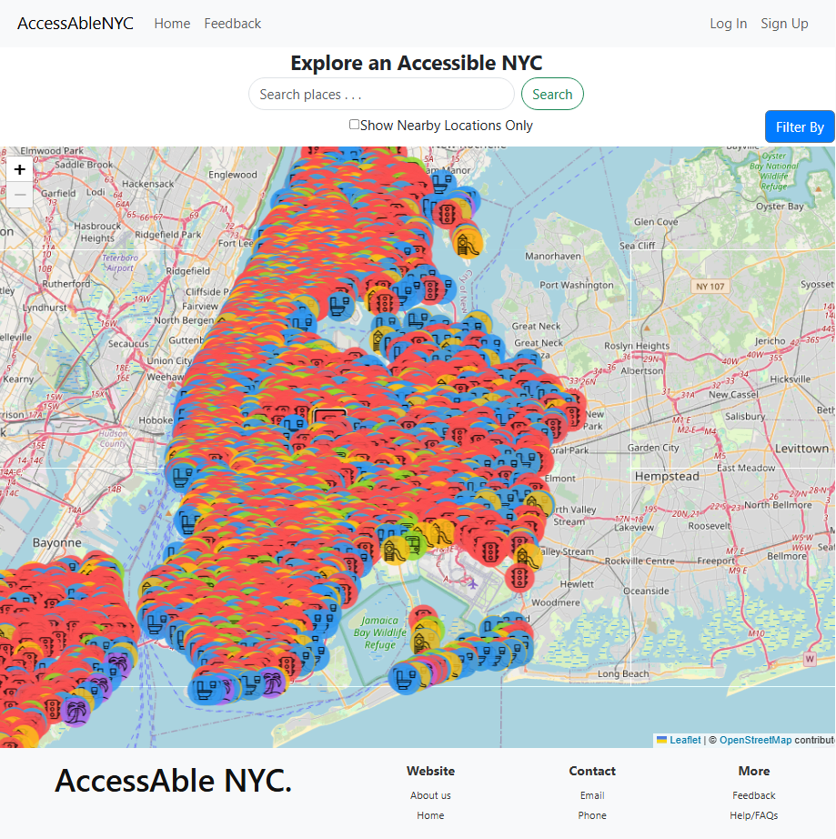

### Map Filter
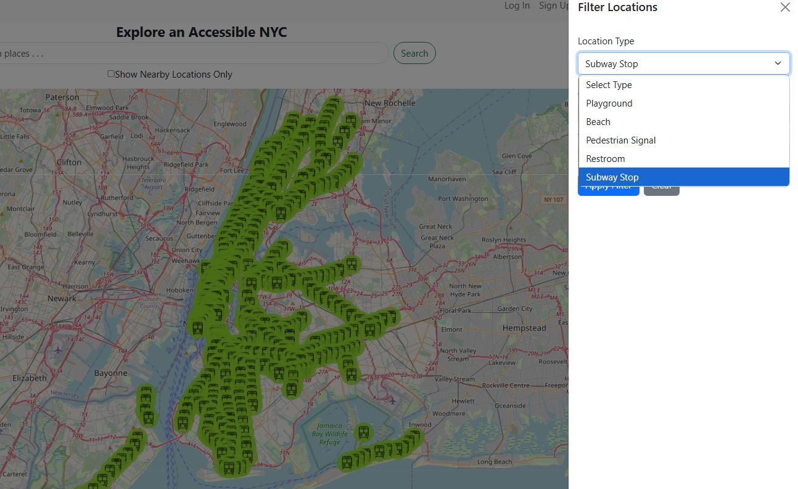
### Beaches
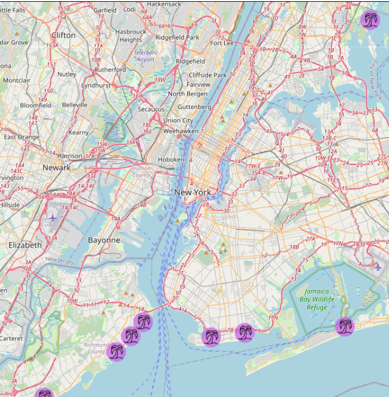
### Playgrounds 
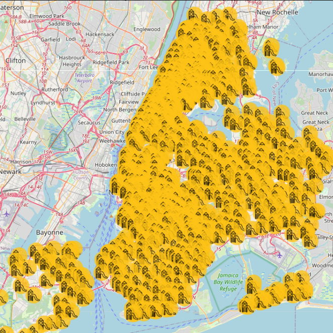
### Traffic Lights
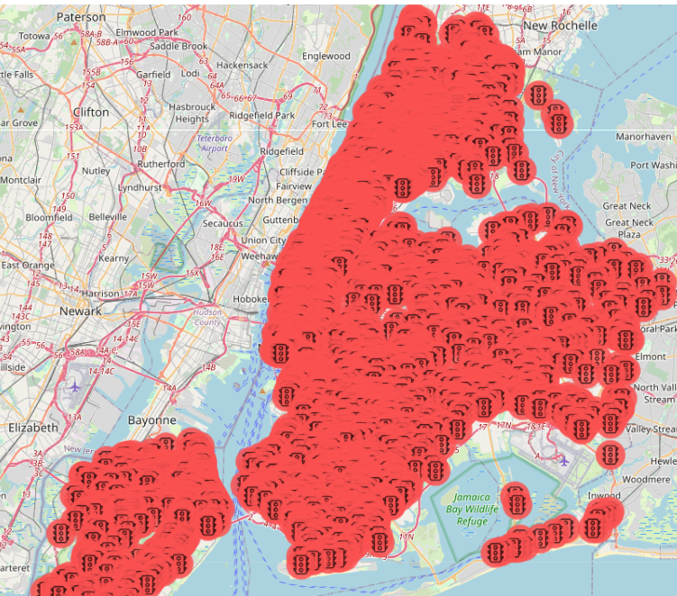
### Subway stops
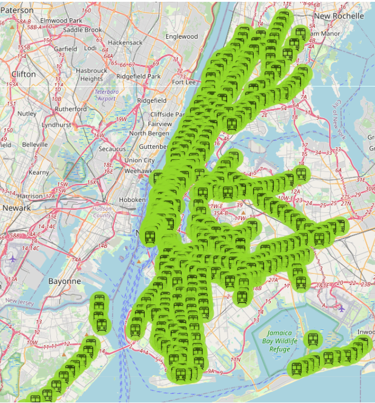
### Public Restrooms
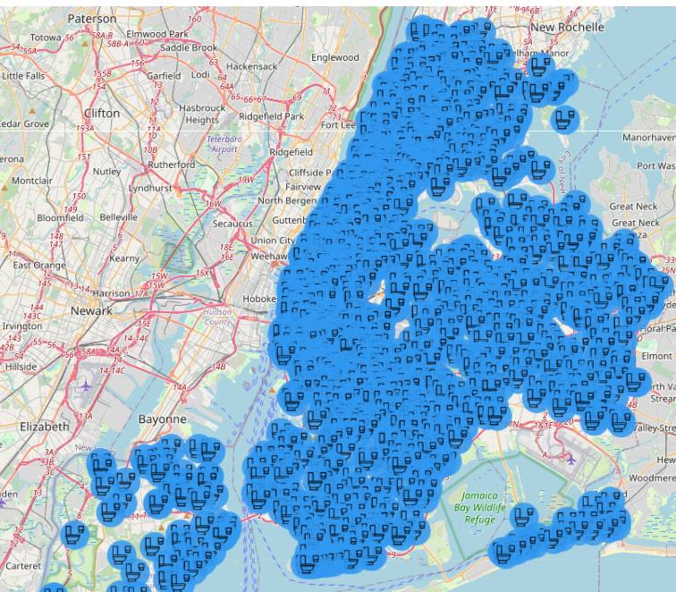
### Search
- All locations in the database are searchable
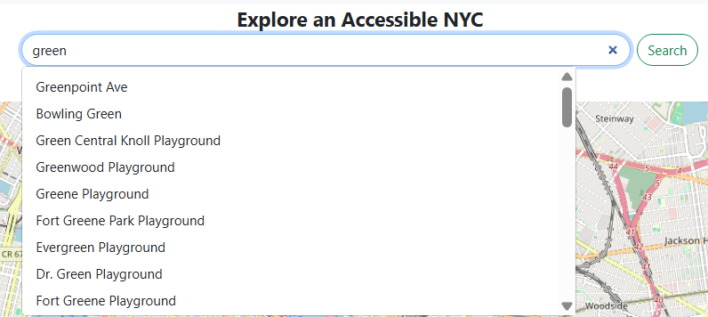
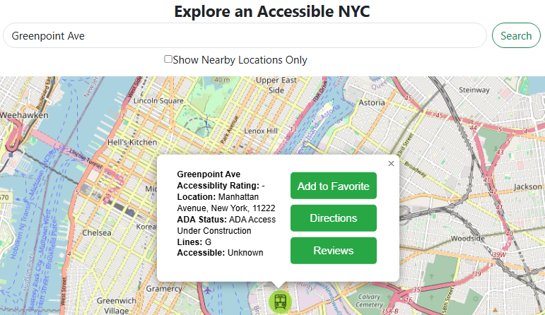
### Map Directions
- Shows accessible walking route between 2 locations (map marker & search or your current loction), taking into account accessible traffic lights
- Not always the most efficient route
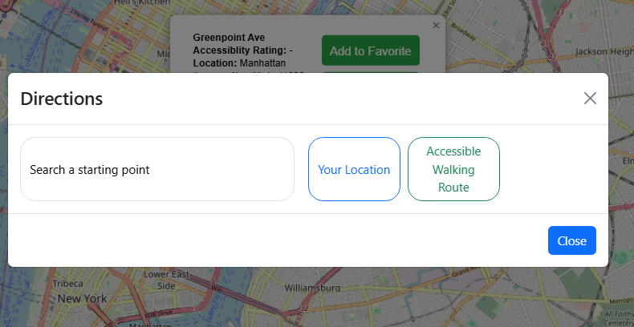
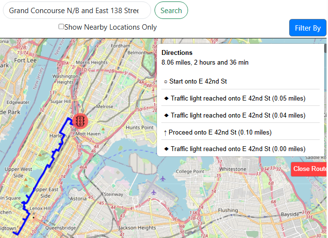

### Sign up page
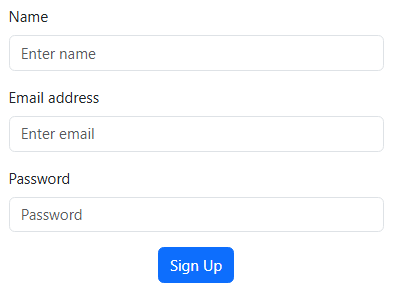
### Login Page
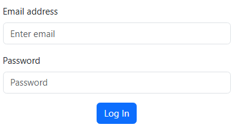
### Feedback Page 
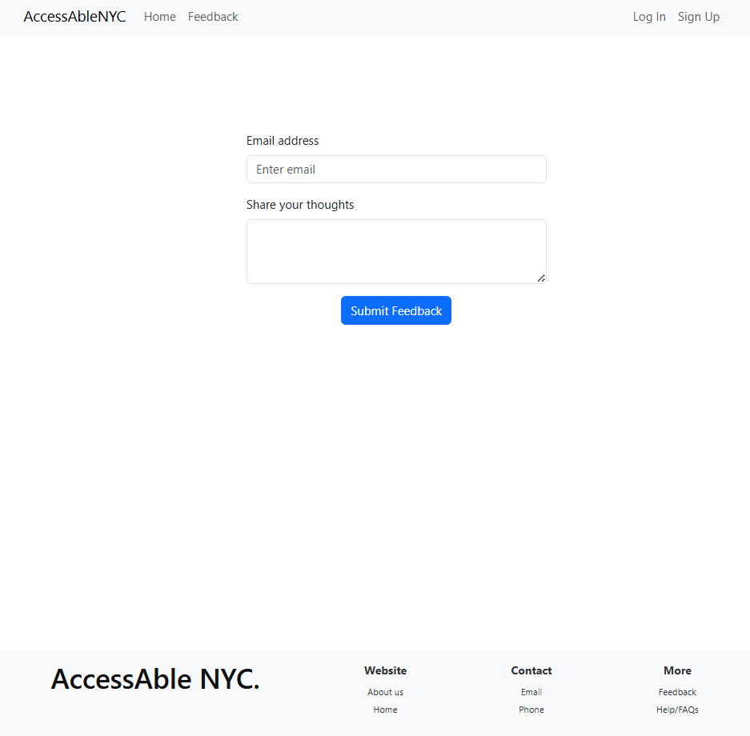

MongoDb Schema
- Collections
    - all_locations
    - feedback
    - reviews
    - users

## Map Location Filters
- Locations and Filtered Accessibility Options
- Not accessible means it is not accessibility friendly

#### Playgrounds
- Accessibility
	- Any
	- Full
	- Partial
	- Not Accessible

#### Beaches
- Accessibility
	- Any
	- Full
	- Not Accessible

#### Public Restrooms
- Accessibility
	- Any
	- Full
	- Partial
	- Not Accessible 
- Restroom Type
	- Single-Stall
	- Multi-Stall
	- Both
- Operator
	- NYC Parks
	- BPL
	- Park Avenue Plaza Owner LLC
	- NYC DOT / JCDecaux

#### Pedestrian Signals
- Accessibility
	- Any
	- Accessible
	- Not Accessible

#### Subway stops
- Accessibility
	- Any
	- Accessible
	- Not Accessible
	- Unknown
	- Partial ADA
- ADA Status
	- Full ADA accessible
	- Partial ADA accessible

